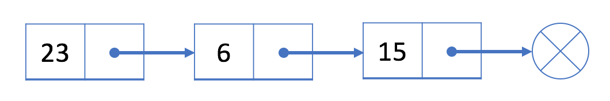

::: tip

各数据结构及LeetCode例题

:::

<!-- more -->
## 一、栈

> 栈的特点是只能在某一端添加或删除数据，遵循先进后出的原则

应用场景

- 函数调用堆栈、字符串括号有效性、十进制转二进制

  

### 1）实现

```js
class Stack {
  constructor() {
    this.stack = []
  }
  push(item) {
    this.stack.push(item)
  }
  pop() {
    this.stack.pop()
  }
  peek() {
    return this.stack[this.getCount() - 1]
  }
  getCount() {
    return this.stack.length
  }
  isEmpty() {
    return this.getCount() === 0
  }
}
```

### 2）例题

1.2.1 题意是匹配括号，可以通过栈的特性来完成这道题目（LeetCode：20）

```js
var isValid = function(s) {
  if (s.length % 2 === 1) return false;
  let map = {
    '(': -1,
    ')': 1,
    '[': -2,
    ']': 2,
    '{': -3,
    '}': 3
  };
  let stack = [];
  for (let i = 0; i < s.length; i++) {
    if (map[s[i]] < 0) {
      stack.push(s[i]);
    } else {
      let last = stack.pop();
      if (map[last] + map[s[i]] != 0) return false;
    }
  }
  return stack.length === 0;
}
```

1.2.2 二叉树的前序遍历（LeetCode 144）

```
/**
 * Definition for a binary tree node.
 * function TreeNode(val, left, right) {
 *     this.val = (val===undefined ? 0 : val)
 *     this.left = (left===undefined ? null : left)
 *     this.right = (right===undefined ? null : right)
 * }
 */
/**
 * @param {TreeNode} root
 * @return {number[]}
 */
var preorderTraversal = function(root) {
    const res = [];
    const stack = [];
    if (root) {
        stack.push(root);
    }
    while (stack.length) {
        let temp = stack.pop();
        res.push(temp.val);
        if (temp.right) {
            stack.push(temp.right);
        }
        if (temp.left) {
            stack.push(temp.left);
        }
    }
    return res;
};
```

## 二、队列

队列 - 先进先出

### 1）使用场景

食堂排队打饭、EventLoop任务队列里，计数器你最近请求次数

### 2）LeetCode 993最近的请求次数

```
var RecentCounter = function() {
    this.q = [];
};

/** 
 * @param {number} t
 * @return {number}
 */
RecentCounter.prototype.ping = function(t) {
    this.q.push(t);
    while (this.q[0] < t - 3000) {
        this.q.shift();
    }
    return this.q.length;
};

/**
 * Your RecentCounter object will be instantiated and called as such:
 * var obj = new RecentCounter()
 * var param_1 = obj.ping(t)
 */
```


## 三、链表

链表是一个线性结构，同时也是一个天然的递归结构。链表结构可以充分利用计算机内存空间，实现灵活的内存动态管理。但是链表失去了数组随机读取的优点，同时链表由于增加了结点的指针域，空间开销比较大。



### 1）LeetCode 206 一个单向链表反转

```js
/**
 * Definition for singly-linked list.
 * function ListNode(val) {
 *     this.val = val;
 *     this.next = null;
 * }
 */
/**
 * @param {ListNode} head
 * @return {ListNode}
 */
var reverseList = function (head) {
  let pre = null; // 创建这个变量作为反转链表的尾部
  let cur = head; // 这个变量用于不断的移动指针。
  // 开始进行翻转
  while (cur !== null) {
		// 翻转之前需要先保存next节点，不然翻转之后找不到这个位置的元素了
    let next = cur.next;
		// 当前节点next指针翻转指向pre前置节点
    cur.next = pre;
		// 将pre 移动到 cur当前的位置
    pre = cur;
		// 将cur 移动到 next的位置 执行下一次的循环
    cur = next
  }
  // 退出while循环的条件是 cur 为 null。只要明白一件事情
  // pre 指向的是cur的前一个元素。所以翻转之后返回的应该是pre
  return pre;
};
```

### 2）LeetCode 2 两数相加

```js
/**
 * Definition for singly-linked list.
 * function ListNode(val, next) {
 *     this.val = (val===undefined ? 0 : val)
 *     this.next = (next===undefined ? null : next)
 * }
 */
/**
 * @param {ListNode} l1
 * @param {ListNode} l2
 * @return {ListNode}
 */
var addTwoNumbers = function(l1, l2) {
    const l3 = new ListNode(0);
    let p1 = l1;
    let p2 = l2;
    let p3 = l3;
    let carry = 0;
    while (p1 || p2) {
        const v1 = p1 ? p1.val : 0;
        const v2 = p2 ? p2.val : 0;
        const v3 = v1 + v2 + carry;
        p3.next = new ListNode(v3 % 10);
        carry = Math.floor(v3 / 10);
        if (p1) p1 = p1.next;
        if (p2) p2 = p2.next;
        p3 = p3.next;
    }
    if (carry) {
        p3.next = new ListNode(carry);
    }
    return l3.next;
};
```

### 3）LeetCode 83 删除排序链表中的重复元素

```js
/**
 * Definition for singly-linked list.
 * function ListNode(val, next) {
 *     this.val = (val===undefined ? 0 : val)
 *     this.next = (next===undefined ? null : next)
 * }
 */
/**
 * @param {ListNode} head
 * @return {ListNode}
 */
var deleteDuplicates = function(head) {
    let p = head;
    while (p && p.next) {
        if (p.val === p.next.val) {
            p.next = p.next.next;
        } else {
            p = p.next;
        }
    }
    return head;
};
```

### 4）LeetCode 141 环形链表

```js
/**
 * Definition for singly-linked list.
 * function ListNode(val) {
 *     this.val = val;
 *     this.next = null;
 * }
 */

/**
 * @param {ListNode} head
 * @return {boolean}
 */
// 快慢指针，p2每次走两步，总会追上p1
var hasCycle = function(head) {
    let p1 = head;
    let p2 = head;
    while (p1 && p2 && p2.next) {
        p1 = p1.next;
        p2 = p2.next.next;
        if (p1 === p2) {
            return true;
        }
    }
    return false;
};
```

### 5）JS的应用：js原型链

1. 如果`A`沿着原型链能找到`B.prototye`，那么`A instanceof B`为`true`
2. 如果在`A`对象上没有找到`x`属性，那么会沿着原型链找`x`

#### 5.1 `instanceof`原理及实现

解法：遍历`A`的原型链，找`B.prototye`

```js
const instanceOf = (a, b) => {
    let p = a;
    while (p) {
        if (p === b.prototype) {
            return true;
        }
        p = p.__proto__;
    }
    return false;
}
```

### 6）使用链表指正获取`JSON`节点值

```js
let Json = {
    a: { b: { c: 1 } },
    d: { e: { f: 2 } },
};
const path = ['a', 'b', 'c'];
let p = Json;
path.forEach( k => {
    p = p[k];
});
```


## 四、树

### 1）二叉树

树拥有很多种结构，二叉树是树中最常用的结构，同时也是一个天然的递归结构。

二叉树拥有一个根节点，每个节点至多拥有两个子节点，分别为：左节点和右节点。树的最底部节点称之为叶节点，当一颗树的叶数量数量为满时，该树可以称之为**满二叉树**。

### 2）二分搜索树

二分搜索树也是二叉树，拥有二叉树的特性。但是区别在于二分搜索树每个节点的值都比他的左子树的值大，比右子树的值小。

这种存储方式很适合于**数据搜索**。


### 3）遍历

在遍历树的过程中，每个节点都会遍历三次，分别是遍历到自己，遍历左子树和遍历右子树。

- 先序遍历
- 中序遍历
- 后序遍历

```js
// 先序遍历可用于打印树的结构
// 先序遍历先访问根节点，然后访问左节点，最后访问右节点。
preTraversal() {
  this._pre(this.root)
}
_pre(node) {
  if (node) {
    console.log(node.value)
    this._pre(node.left)
    this._pre(node.right)
  }
}
// 中序遍历可用于排序
// 对于 BST 来说，中序遍历可以实现一次遍历就
// 得到有序的值
// 中序遍历表示先访问左节点，然后访问根节点，最后访问右节点。
midTraversal() {
  this._mid(this.root)
}
_mid(node) {
  if (node) {
    this._mid(node.left)
    console.log(node.value)
    this._mid(node.right)
  }
}
// 后序遍历可用于先操作子节点
// 再操作父节点的场景
// 后序遍历表示先访问左节点，然后访问右节点，最后访问根节点。
backTraversal() {
  this._back(this.root)
}
_back(node) {
  if (node) {
    this._back(node.left)
    this._back(node.right)
    console.log(node.value)
  }
}
```

### 4）例题

##### 3.4.1 如何在树中寻找最小值或最大数

因为二分搜索树的特性，所以最小值一定在根节点的最左边，最大值相反

```js
getMin() {
  return this._getMin(this.root).value
}
_getMin(node) {
  if (!node.left) return node
  return this._getMin(node.left)
}
getMax() {
  return this._getMax(this.root).value
}
_getMax(node) {
  if (!node.right) return node
  return this._getMin(node.right)
}
```

##### 3.4.2 **排名**

这是用于获取给定值的排名或者排名第几的节点的值，这两个操作也是相反的，所以这个只介绍如何获取排名第几的节点的值。

```js
class Node {
  constructor(value) {
    this.value = value
    this.left = null
    this.right = null
    // 每个节点拥有一个 size 属性。该属性表示该节点下有多少子节点（包含自身）
    this.size = 1
  }
}
select(k) {
  let node = this._select(this.root, k)
  return node ? node.value : null
}
_select(node, k) {
  if (!node) return null
  // 先获取左子树下有几个节点
  let size = node.left ? node.left.size : 0
  // 判断 size 是否大于 k
  // 如果大于 k，代表所需要的节点在左节点
  if (size > k) return this._select(node.left, k)
  // 如果小于 k，代表所需要的节点在右节点
  // 注意这里需要重新计算 k，减去根节点除了右子树的节点数量
  if (size < k) return this._select(node.right, k - size - 1)
  return node
}
```

## 五、堆

堆的实现通过构造**二叉堆**，实为二叉树的一种。这种数据结构具有以下性质：

- 任意节点小于（或大于）它的所有子节点
- 堆总是一棵完全树。即除了最底层，其他层的节点都被元素填满，且最底层从左到右填入。

将根节点最大的堆叫做**最大堆**或**大根堆**，根节点最小的堆叫做**最小堆**或**小根堆**。

堆排序的原理就是组成一个大根堆或者小根堆。某个节点的左边子节点索引是 `i * 2 + 1`，右边是 `i * 2 + 2`，父节点是 `(i - 1) /2`。

1. 首先遍历数组，判断该节点的父节点是否比他小，如果小就交换位置并继续判断，直到他的父节点比他大
2. 重新以上操作 1，直到数组首位是最大值
3. 然后将首位和末尾交换位置并将数组长度减一，表示数组末尾已是最大值，不需要再比较大小
4. 对比左右节点哪个大，然后记住大的节点的索引并且和父节点对比大小，如果子节点大就交换位置
5. 重复以上操作 3 - 4 直到整个数组都是大根堆。

```js
function heap(array) {
  checkArray(array)
  // 将最大值交换到首位
  for (let i = 0; i < array.length; i++) {
    heapInsert(array, i)
  }
  let size = array.length
  // 交换首位和末尾
  swap(array, 0, --size)
  while (size > 0) {
    heapify(array, 0, size)
    swap(array, 0, --size)
  }
  return array
}

function heapInsert(array, index) {
  // 如果当前节点比父节点大，就交换
  while (array[index] > array[parseInt((index - 1) / 2)]) {
    swap(array, index, parseInt((index - 1) / 2))
    // 将索引变成父节点
    index = parseInt((index - 1) / 2)
  }
}
function heapify(array, index, size) {
  let left = index * 2 + 1
  while (left < size) {
    // 判断左右节点大小
    let largest =
      left + 1 < size && array[left] < array[left + 1] ? left + 1 : left
    // 判断子节点和父节点大小
    largest = array[index] < array[largest] ? largest : index
    if (largest === index) break
    swap(array, index, largest)
    index = largest
    left = index * 2 + 1
  }
}
```

## 六、集合

- **无序且唯一**的数据结构
- `ES6` -> `Set` : 去重、某元素是否在集合中，求交集

eg. 求交集：

```js
const set1 = new Set([1,2]);
const set2 = new Set([3,2]);
const set3 = new Set([...set].filter(item => set2.has(item)));
```

### 1）LeetCode 349 两个数组的交集

```
类似上面的求交集操作，不过.has可以用数组的.includes替代更快
```

### 2）`ES6`中的`Set`

> 本文由[李俊乐-网络日志](https://dirtypool.top) 发布