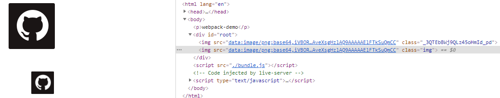

::: tip

初步认知Webpack，熟悉webpack的核心概念->Loader

:::

<!-- more -->
## 一、webpack初步认知

模块打包工具

```
yarn add webpack-cli webpack --save-dev
webpack-cli用于命令行webpack命令
```

### 1）如何用webpack打包

1. 控制台直接打包`/src`下的文件

   ```shell
   npx webpack
   ```

2. 指定`webpack`配置文件打包`/src`下的文件

   ```shell
   npx webpack --config 文件名xxx
   ```

   配置文件：`webpack.config.js`

   ```js
   const path = require('path');
   // output.path 后接绝对路径，引入path实现
   module.exports = {
       mode: "production",// production为默认压缩，development为不压缩
       entry: './src/index.js',
       output: {
           filename: 'bundle.js',
           path: path.resolve(__dirname, 'dist')// __dirname 为配置文件所在路径
       }
   }
   /*
   * entry: './src/index.js'等同于entry: {main: './src/index.js'}
   */
   ```

## 二、webpack核心概念 - Loader

### 1）Loader 图片

> loader就是打包方案，这允许你打包除 JavaScript 之外的任何静态资源

#### 2.1.1 `url-loader` 及 `file-loader`

> `file-loader`是个很重要的打包工具，可以对`webpack`不能识别的文件进行处理

1. 使用`file-loader`： 将文件发送到输出文件夹，并**返回（相对）URL**，较小的图片也可以使用`url-loader`转`BASE64`，减少`HTTP`请求。

    > 注意：使用`url-loader`打包时，小于`limit`的的图片是使用`file-loader`来打包的，也需要安装`file-loader`

    ```json
    module.exports = {
      module: {
        rules: [{
            test: /\.(png|jpg|gif)$/,
            use: [{
                loader: 'url-loader',
                options: {
                    // Placeholders 占位符匹配
                    name: '[name]_[hash].[ext]',
                    outputPath: 'images',
                    limit: 20480 // 小于20kb转base64
                }
              }]
          }]
      }
    }
    ```

2. 生成文件 `file.png`，输出到输出目录并返回 `public URL`

    ```json
    "/public/path/0dcbbaa7013869e351f.png"
    ```

3. 使用

    ```js
    import github from './github.png';
    var img = new Image();
    img.src = github;
    var dom = document.getElementById('root');
    dom.append(img);
    ```

### 2）Loader 样式

#### 2.2.1 使用`style-loader`和`css-loader`

```json
{
    test: /\.css$/,
    use: [
        { loader: "style-loader" },// 将 JS 字符串生成为 style 节点
        {
            loader: "css-loader",// 将 CSS 转化成 CommonJS 模块
            option: { importLoaders: 2 } // 遇到@import还需要走下面两个loader
        },
        { loader: "sass-loader" },// 将 Sass 编译成 CSS
        { loader: "postcss-loader" },// 厂商前缀兼容
    ]
}
```

>  `Loader`的使用顺序，**从下到上，从右到左**，先是`sass-loader`->`css-loader`解析，再`style-loader`挂载到页面上

#### 2.2.2 `postcss-loader`厂商前缀兼容

1. postcss.config.js

    ```js
    module.exports = {
      plugins: [
          require('autoprefixer')
      ]
    }
    ```

2. 安装`autoprefixer`插件，可以实现自动填充`postcss.config.js`里的`plugins`，无需配置

3. 在`package.json`中增加键值

   ```json
   "browserslist": [
       "last 1 version",
       "> 1%",
       "IE 10"
   ]
   ```

4. 效果：


#### 2.2.3 `CSS`的模块化

例子：新增一个图片，只有`index`的图片受到`css`属性影响

> 只作用于需要引用`css`属性的使用

1. index.js

    ```js
    import ImagePNG from "./image";
    import css from './index.css';
    import github from './github.png';

    var img = new Image();
    img.src = github;
    img.classList.add(css.img);
    var dom = document.getElementById('root');

    dom.append(img);
    new ImagePNG();
    ```

2. image.js （未生效）

   ```js
   import github from './github.png';
   import './index.scss';
   
   function ImagePNG() {
       var img = new Image();
       img.src = github;
       img.classList.add('img');
       var dom = document.getElementById('root');
       dom.append(img);
   }
   export default ImagePNG;
   ```

3. webpack.config.js

   ```json
   {
       loader: "css-loader",
       options: {
           importLoaders: 2,
           modules: true //开启模块化
       }
   },
   ```

4. 效果：只有`index.js`中的`css`起到了效果，`class`为`img`的没有生效

    

> 本文由[李俊乐-网络日志](https://dirtypool.top) 发布